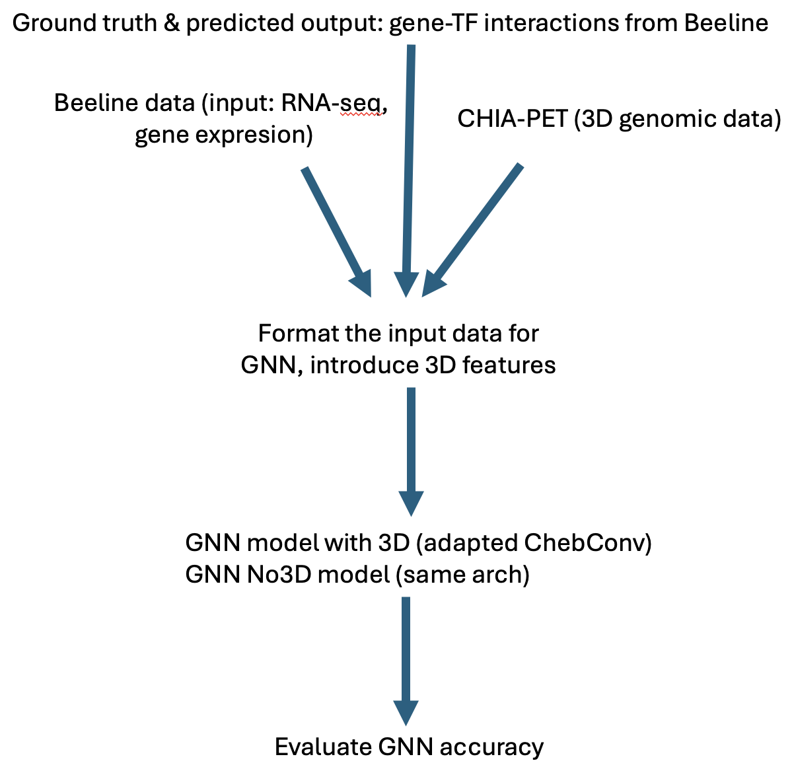

# Team10: GNNs for GRNs

## Aim

Use Chromatin conformation captrure assay data to enhance for GRN predictions from scRNA-Seq.

## Contributions

Michał Denkiewicz, Paulina Kaczyńska, Sabrina Kwak, Gobikrishnan Subramaniam, Jacob Bumgarner, Asha Ajithakumari Sobhanakumar, Palash Sethi, Ammara Saleem, Aleksandra Sobieska

## Method

  

### Progress

1. Get expression data from BEELINE: [DONE]
   *. Evalutaing other cell lines
2. Get 3D conformation data from 4DN: [IN_PROGRESS]
3. Make preprocessing code: [IN_PROGRESS]
4. Map GRN nodes to the 3D data. [TODO]
5. Setup final shared training environment [IN_PROGRESS]
   *. Problems installing pytorch_geometric on AWS
   *. ...but we have other options
6. Adjust the notebook to use our datasets [IN_PROGRESS]
7. Technical run (No3D net) [DONE]
8. Results presentation and visualization [IN_PROGRESS]

## Installation

## Results & Conclusions

## References

### Basic GNNs:
1. Quick intro: https://blogs.nvidia.com/blog/what-are-graph-neural-networks/
2. A larger review, but I'm not sure if it is best. Nice picture for PowerPoint though:): https://journalofbigdata.springeropen.com/articles/10.1186/s40537-023-00876-4

### Ground truth data:
1. BEELINE: https://pmc.ncbi.nlm.nih.gov/articles/PMC7098173/ and https://zenodo.org/records/3701939
2. https://bio.liclab.net/scGRN/index.php - not sure if it has more data than pt.1
3. DREAM5: (v.old) https://www.synapse.org/Synapse:syn2820440/wiki/71026

### GNN-GRN approaches:
1. https://www.sciencedirect.com/science/article/pii/S1568494624006732#da1 - we can treat this as a baseline, they also provide code using PyTorch Geometric
2. https://www.sciencedirect.com/science/article/pii/S200103702030444X
3. https://genome.cshlp.org/content/32/5/930.full

### Misc:
1. Tunning GNNs (in case we need it): https://machinelearningmastery.com/guide-to-iteratively-tuning-gnns/
2. More on GRNs: https://www.sciencedirect.com/science/article/pii/S2452310021000184

   
