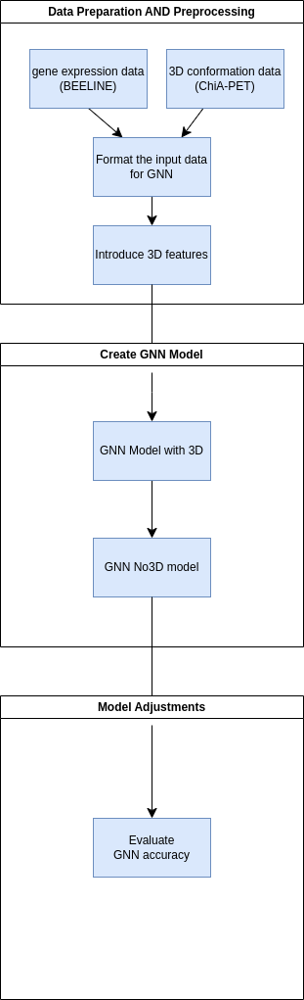
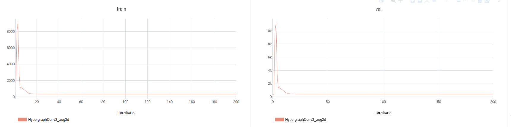

# Team10: GNN4GRN-3D: Gene regulation prediciton from scRNA-Seq expression and 3D genomic data.

## Aim

We use Chromatin conformation captrure assay data to enhance for GRN predictions from combined expression (scRNA-Seq) and chromosome conformation capture reflecting 3D genome structure (Hi-C) data.

We provide an extensible framework for training GNN models on custom datasets, adding the ability to adjust and provide custom features by the user without the need to rewrite training code. We build on previous approaches (Paul et al. 2024) in particular by incorporating chromosome conformation capture data (Hi-C), to improve the GRN predictions from scRNA-Seq to bridge graph-based machine learning and 3D Genomics.

### Use cases:

* Inference of Gene Regulatory Networks (GRNs): Predict novel gene-gene regulatory interactions based on expression patterns, for wet lab biologists to verify.
* Integration of Custom Biological Features: Incorporate prior biological knowledge (e.g., transcription factor motifs, chromatin accessibility, cell type annotations) as node features to improve model accuracy.
* Cell-Type Specific GRN Discovery: Enable GRN predictions that are specific to particular cell types.
* Tool for Multi-omics Data Integration: Extendable framework to incorporate other omics layers (e.g., scATAC-seq, proteomics) alongside scRNA-Seq for richer GRN modeling.


## Contributions

Michał Denkiewicz, Paulina Kaczyńska, Sabrina Kwak, Gobikrishnan Subramaniam, Jacob Bumgarner, Asha Ajithakumari Sobhanakumar, Palash Sethi, Ammara Saleem

## Method

<p align="center">
  
</p>

* For assessment of GNN4GNR-3D we focus on hESC data as an example
* We prepared the dataset for the hESC cell line from the BEELINE dataset.
For the hESC cell line, The input GRN consits of 18234 nodes (Genes), out of which 14996 have corresponding scRNASeq data.

<p align="center">
  
</p>

* We use BEELINE data (Pratapa et al., 2020): the interactions forming GRNs are the predicted data, while the scRNA-Seq data is used as input
We combine this with the Chromosome Conformation Capture (3D) data for the BEELINE GRN dataset for hESC differentiated into endoderm. The 3D data (access ID:4DNFI2WSZPG9) come from 4DN Data Portal generated by Job Dekker Lab at University of Massachusetts Medical School (Dekker et al., 2017; Reiff et al. 2022).
* Data preprocessing: scRNA-Seq matrix is imputed to an autoencoder to produce embeddings, serving as primary features for the network nodes
* The 3D genomics data is employed as follows: each gene is mapped to a loci using the appropriate assembly, and a signal value is extracted for each gene-gene pair from the Hi-C matric (maximum value of O/E). Pairs that exceed a specified threshold form edges of the new network.
* The GNN architecture is based on (Paul et al. 2024).
* Additional node features are added: augmented features computed from the GRN structure (as in base work: betweenness centrality, PageRank score, node degree, clustering coefficient). Importantly, node features are added that contain data relating to 3D structure: each gene-node is mapped to its genomic location, and assigned to a node in the 3D network. Then, betweenness centrality, page rank, degree, clustering coefficient of the gene-node in the 3D network.
* 3 types of models are produced for each dataset: Base (pure expression data), Aug (with network science features calculated from the GRN network), ad finally Aug3D (with features extracted both from GRN and 3D network)

## Installation & Usage

### Requirements

* `PyTorch Geometric` capable system:
  * OS: Linux, pref. Ubuntu >= 22.04
  * CPU: pref. 12+ cores for data preprocessing
  * GPU: Nvidia CUDA-capable (pref. 12.6). CPU computation is also possible
  * RAM: >= 16 GB
* Docker image with the above stack is availible

### Input data format

Place paths to the input 
* Expression data (scRNA-Seq): a `GeneExpression.csv` file with row and column headers: rows are genes, columns are samples
* Names of all genes in the network: a `GeneOrdering.csv` file, with the first column containing the gene names. First row contains header. The other columns are ignored.
* Ground truth network: a `.csv` file, containing the edges of the GRNs, example:
  ```
  Gene1,Gene2
  AR,MTRNR2L2
  AR,MTRNR2L8
  AR,RGPD2
  ```

### Direct installation

1. Setup a python virtual environment (pyenv, conda, mamba etc.)
2. Install dependencies from requirements.txt
3. Prepare the data directory and a config `.json` file (see examples) TODO: elaborate
4. Preprocess input data using `preprocessing.py`
5. Train a network using `train.py` TODO: elaborate
6. TODO: a way to use a ready network for prediction
  
### Using docker

TODO

## Results

We use an encoder-decoder architecture with three HyperGraphConv layers in the encoder module, trained for the link prediction task, similarly to Paul et al. (2024). The dataset is split into training, validation, and test sets using RandomLinkSplit from PyTorch Geometric, and is augmented with negative edges to ensure balance. Validation and testing are also conducted on the balanced dataset. Negative edges are randomly sampled from all possible non-existent edges between nodes in the respective split.

We use the Adam optimizer with a learning rate scheduler that reduces the learning rate by a factor of 0.1 if the validation loss does not decrease for five consecutive epochs. The loss function used is BCEWithLogitsLoss. In contrast to Paul et al. (2024), we add a sigmoid layer at the end of the network during validation and testing, so that the evaluation metrics are computed on values representing the probability of an edge existing.

Similar to Paul et al. (2024), augmentation slightly improves performance.

Resulting scores on test set:
|    | dec     | af_val   |   num_layers |   epoch | aggr   | var            |      auc |     aupr |       mcc |   jac_score |   cohkap_score |       f1 |   top_k | aug    |
|---:|:--------|:---------|-------------:|--------:|:-------|:---------------|---------:|---------:|----------:|------------:|---------------:|---------:|--------:|:-------|
|  0 | dot_sum | F.silu   |            3 |     200 | sum    | HypergraphConv | 0.992565 | 0.981231 | 0.0889979 |     0.25594 |      0.0157168 | 0.407568 | 0.27321 | no_aug |
|  0 | dot_sum | F.silu   |            3 |     200 | sum    | HypergraphConv | 0.987375 | 0.980063 | 0.383218  |     0.362427|      0.262330  | 0.532031 | 0.564721| aug    |
|  0 | dot_sum | F.silu   |            3 |     200 | sum    | HypergraphConv | -        | -        | -         |     -       |      -         | -        | -       | aug3d  |

Training trajectories:
<p align="center">
  
</p>

## Conclusions

We provide an extensible framework for training GNN models for GRN edge prediction on custom datasets, adding the ability to adjust and provide custom features by the user without the need to rewrite training code.

## Future directions

1. Add more architecture configuration options, expand the number of networks used
2. More comprehensive review of datasets
3. Add enhancer data to the network
4. Provide an automated 3D network generation method

Technical:
1. Improve negative set construction
2. Evaluate feature importance
3. Improve the usability and configurability

## References
1.	AKERS, K. & MURALI, T. J. C. O. I. S. B. 2021. Gene regulatory network inference in single-cell biology. 26, 87-97. https://doi.org/10.1016/j.coisb.2021.04.007
2.	JEREESH, A. & KUMAR, G. S. J. A. S. C. 2024. Reconstruction of gene regulatory networks using graph neural networks. 163, 111899. https://doi.org/10.1016/j.asoc.2024.111899
3.	KARBALAYGHAREH, A., SAHIN, M. & LESLIE, C. S. J. G. R. 2022. Chromatin interaction–aware gene regulatory modeling with graph attention networks. 32, 930-944.doi: 10.1101/gr.275870.121
4.	KHEMANI, B., PATIL, S., KOTECHA, K. & TANWAR, S. J. J. O. B. D. 2024. A review of graph neural networks: concepts, architectures, techniques, challenges, datasets, applications, and future directions. 11, 18.https://doi.org/10.1186/s40537-023-00876-4
5.	Li, C., 2025. scGRN: A comprehensive single-cell multi-omics gene regulatory network platform of human and mouse. scGRN. https://bio.liclab.net/scGRN/index.php [Accessed 15 May 2025].
6.	Marbach, D., et al., 2012. DREAM5 Network Inference Challenge. Synapse. https://www.synapse.org/Synapse:syn2820440/wiki/71026 [Accessed 15 May 2025].
7.	NVIDIA, 2021. What are graph neural networks? NVIDIA Blog. https://blogs.nvidia.com/blog/what-are-graph-neural-networks/ [Accessed 15 May 2025].
8.	PRATAPA, A., JALIHAL, A. P., LAW, J. N., BHARADWAJ, A. & MURALI, T. J. N. M. 2020. Benchmarking algorithms for gene regulatory network inference from single-cell transcriptomic data. 17, 147-154.doi: 10.1038/s41592-019-0690-6
9.	WANG, J., MA, A., MA, Q., XU, D., JOSHI, T. J. C. & JOURNAL, S. B. 2020. Inductive inference of gene regulatory network using supervised and semi-supervised graph neural networks. 18, 3335-3343. https://doi.org/10.1016/j.csbj.2020.10.022 
